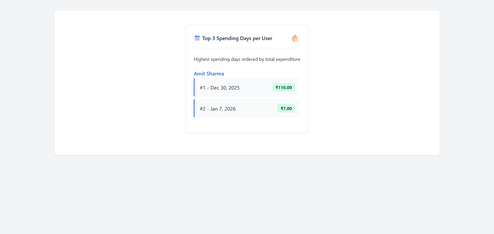
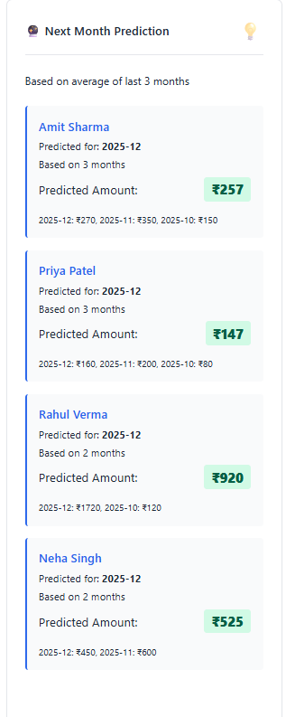

# Expense Tracker

Full-stack expense management application with React, Node.js, Express, and MySQL.

## Project Screenshots

### 1. Top Spending Days

_Shows the top 3 days where each user spent the most_

### 2. Monthly Change

_Displays percentage increase or decrease in spending compared to last month_

### 3. Next Month Prediction

_Forecasts next month's spending based on the 3-month average_


## Quick Start

### 1. Prerequisites
- Node.js (v14+)
- MySQL Server
- npm or yarn

### 2. Setup Instructions

#### Database Setup
1. Start your MySQL server.
2. Create the database and use it:
   ```sql
   CREATE DATABASE expense_tracker;
   USE expense_tracker;
   ```
3. Import the schema found in `database/schema.sql` into the database. You can do this via command line or a GUI tool like Workbench/HeidiSQL.

#### Backend Setup
1. Navigate to the backend directory:
   ```bash
   cd backend
   ```
2. Install dependencies:
   ```bash
   npm install
   ```
3. Configure environment variables:
   - Copy `.env.example` to `.env`:
     ```bash
     cp .env.example .env
     # Windows Command Prompt: copy .env.example .env
     ```
   - Open `.env` and update your database credentials (password specifically):
     ```properties
     PORT=5000
     DB_HOST=localhost
     DB_USER=root
     DB_PASSWORD=your_password_here  # <--- Update this
     DB_NAME=expense_tracker
     ```
4. Start the backend server:
   ```bash
   npm start
   ```
   *The backend will run on `http://localhost:5000`*

#### Frontend Setup
1. Open a new terminal and navigate to the frontend directory:
   ```bash
   cd frontend
   ```
2. Install dependencies:
   ```bash
   npm install
   ```
3. Start the React development server:
   ```bash
   npm start
   ```
   *The frontend will run on `http://localhost:3000`*

## API Endpoints

**Expenses**
- `GET /api/expenses` - Get expenses (filters: user_id, category_id, start_date, end_date)
- `GET /api/expenses/:id` - Get single expense
- `POST /api/expenses` - Create expense
- `PUT /api/expenses/:id` - Update expense
- `DELETE /api/expenses/:id` - Delete expense

**Users**
- `GET /api/users` - Get all users
- `GET /api/users/:id` - Get user by ID

**Categories**
- `GET /api/categories` - Get all categories
- `GET /api/categories/:id` - Get category by ID

**Statistics**
- `GET /api/statistics/top-days` - Top 3 spending days per user
- `GET /api/statistics/monthly-change` - Monthly spending change %
- `GET /api/statistics/predict-next-month` - Next month prediction

## Features

- Full CRUD operations for expenses
- User and category management
- Advanced filtering (user, category, date range)
- Three statistical analytics:
  1. Top spending days per user
  2. Monthly percentage change
  3. Predictive analytics (next month forecast)
- Redux state management
- React Query for API caching
- Form validation (client + server)
- Responsive design


## Project Screenshots

### 1. Top Spending Days

_Shows the top 3 days where each user spent the most_

### 2. Monthly Change

_Displays percentage increase or decrease in spending compared to last month_

### 3. Next Month Prediction

_Forecasts next month's spending based on the 3-month average_


## Tech Stack

**Frontend:** React 18, Redux Toolkit, React Query, Axios
**Backend:** Node.js, Express.js
**Database:** MySQL
**Validation:** express-validator
**Styling:** Modern CSS

## Project Structure

```
expense-tracker/
├── backend/
│   ├── config/
│   │   └── database.js
│   ├── controllers/
│   │   ├── categoryController.js
│   │   ├── expenseController.js
│   │   ├── statisticsController.js
│   │   └── userController.js
│   ├── middleware/
│   │   └── validation.js
│   ├── routes/
│   │   ├── categories.js
│   │   ├── expenses.js
│   │   ├── statistics.js
│   │   └── users.js
│   ├── utils/
│   │   └── validators.js
│   ├── .env
│   ├── package.json
│   └── server.js
├── frontend/
│   ├── src/
│   │   ├── components/
│   │   │   ├── ExpenseForm.jsx
│   │   │   ├── ExpenseList.jsx
│   │   │   ├── FilterSection.jsx
│   │   │   └── Statistics.jsx
│   │   ├── services/
│   │   │   └── api.js
│   │   ├── store/
│   │   │   ├── slices/
│   │   │   └── store.js
│   │   ├── styles/
│   │   │   └── App.css
│   │   ├── App.jsx
│   │   └── index.js
│   └── package.json
├── database/
│   └── schema.sql
└── README.md
```

## Postman Collection

Import `backend/Expense_Tracker_API.postman_collection.json` for API testing.

## Troubleshooting

**MySQL Connection Failed**
- Verify MySQL is running
- Check credentials in `backend/config/database.js`
- Ensure database exists: `CREATE DATABASE expense_tracker;`

**Port Already in Use**
- Backend uses port 5000
- Frontend uses port 3000
- Change ports if needed in configuration

**CORS Issues**
- Backend configured for `http://localhost:3000`
- Update in `server.js` if using different port

## Development

Backend runs with auto-reload:
```bash
cd backend
npm run dev
```

## Notes

- No ORM used (raw SQL queries)
- Client and server-side validation
- Foreign key constraints for data integrity
- RESTful API architecture
- Sample data included for testing

